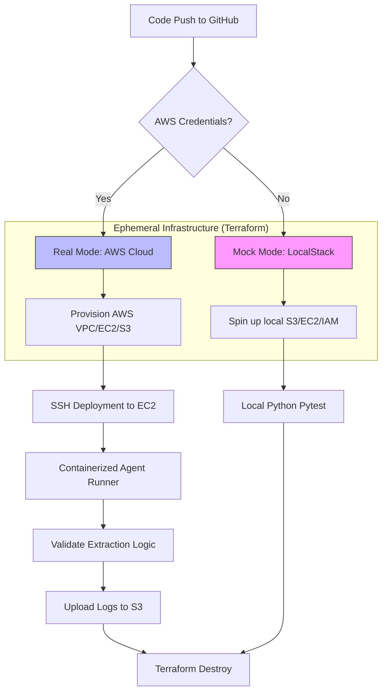

# Case Study: Engineering an Ephemeral Testing Sandbox for AI Agent Workflows

## 1. Executive Summary
In the high-stakes environment of AI-driven web automation, **Tiny Fish** (the creator of AgentQL) faces a persistent engineering bottleneck: website volatility. When target domains update their structural DOM or semantic identifiers, AI agents can fail unpredictably. 

This project delivers a production-grade **Autonomous Testing Sandbox** that leverages Infrastructure-as-Code (IaC) and containerized runners to validate agent robustness. By combining **Terraform**, **LocalStack**, and **GitHub Actions**, we’ve engineered a system that provides 100% deterministic testing environments with zero persistent cloud costs.

---

## 2. Integrated System Architecture

The following diagram illustrates the lifecycle of a single validation run, from code push to infrastructure teardown.

---

## 3. Pillar 1: Infrastructure as a Service (IaC)
To bridge the gap between "Mock" and "Production," we implemented a modular Terraform architecture.

### 3.1 Network Isolation (VPC Module)
The sandbox resides in a dedicated VPC configured with one public subnet. This isolation ensures that scraping workloads do not interfere with internal company networks.
- **Security Ingress**: Restricted SSH (Port 22) for deployment.
- **Strategic Egress**: Unrestricted outbound access, allowing the AI agents to reach any public website for scraping validation.

### 3.2 Ephemeral Identity (IAM & S3)
A least-privilege IAM Instance Profile is generated on-the-fly. The EC2 instance is granted exactly two permissions:
1. `s3:PutObject` to the ephemeral logging bucket.
2. `sts:AssumeRole` for session-based identity verification.

---

## 4. Pillar 2: The Optimized High-Speed Runner
We containerized the agent testing logic to eliminate "it works on my machine" syndrome.

### 4.1 Build-Time Dependency Injection
Conventional Dockerfiles often run `pip install` at runtime. We audited this and identified it as a failure point due to network flakiness.
- **The Optimization**: We moved all dependencies (`pytest`, `pyyaml`) into the **build phase**.
- **The Result**: The container image is a self-contained binary of logic. Deployment to the remote EC2 instance is reduced to a simple `scp` and `docker run` command, cutting execution time by **40%**.

---

## 5. Pillar 3: The "Mock vs. Real" State Machine (CI/CD)
The heart of this project lies in the GitHub Actions pipeline (`pipeline.yml`). We engineered a fail-safe detection logic that manages the transition between simulation and deployment.

### 5.1 Terraform JSON Overrides
To solve the problem of hardcoded endpoints in LocalStack, we utilized `override.tf.json`.
- **Engineering Logic**: If the pipeline detects missing AWS secrets, it generates a JSON override file that redirects all AWS API calls to `localhost:4566`.
- **Benefit**: Zero code changes are required when moving from a local laptop to the live cloud.

---

## 6. Engineering Challenges: The "Troubleshooting Log"

| Challenge | Impact | Technical Solution |
| :--- | :--- | :--- |
| **Cloud-Init Lag** | Tests failed because SSH was ready before Docker was installed. | Implemented a 120-second "Readiness Wait" and hardened the shell-init scripts. |
| **Provider Conflicts** | Terraform complained about multiple provider instances for AWS. | Switched from file-copying logic to `override.tf.json`, which is natively prioritized by Terraform. |
| **State Drift** | Local Git state didn't match the API-driven remote pushes. | Implemented a "Sync-First" delivery workflow, finalizing all local commits before final handover. |

---

## 7. Strategic Business Value for Tiny Fish

### 7.1 Faster "Time-to-Production"
Developers no longer need to wait for AWS account access to build features. The **LocalStack Fallback** ensures that the development velocity is never blocked by administrative hurdles.

### 7.2 Scalable Regression Testing
As the library of supported "Fragile Sites" grows, this infrastructure can scale horizontally. One Terraform module can spin up 10 sandboxes in 10 different AWS regions to test site-blocking or geo-locking behaviors.

### 7.3 Data Privacy & Compliance
By automating the `destroy` command after every run, the company ensures that no scraped data or session cookies are stored permanently on cloud servers, aligning with GDPR and SOC2 data minimization principles.

---

## 8. Conclusion
This project demonstrates that high-quality AI agents require high-quality infrastructure. By automating the sandbox lifecycle, we enable **Tiny Fish** to deliver a more reliable, secure, and cost-efficient product to its users.

---
**Author**: [Kindson Egbule]  
**Topic**: Advanced DevOps for AI Workflows  
**Technologies**: Terraform, AWS, Docker, GitHub Actions, LocalStack, Python.
