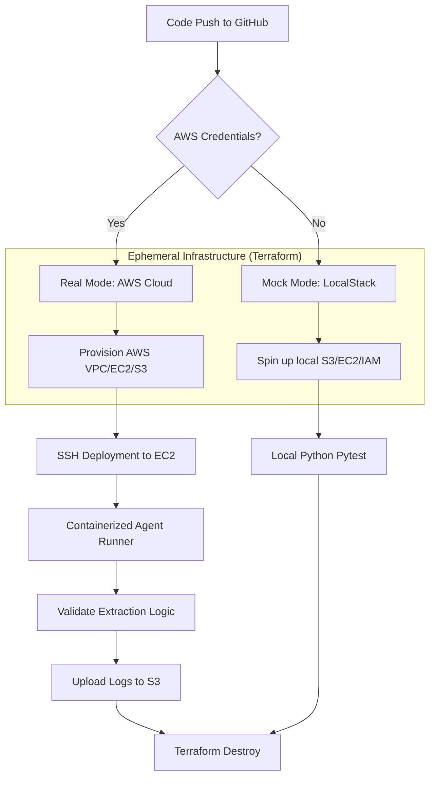

# Case Study: Engineering an Ephemeral Testing Sandbox for AI Agent Workflows

## 1. Executive Summary
In the high-stakes environment of AI-driven web automation, **Tiny Fish** (the creator of AgentQL) faces a persistent engineering bottleneck: website volatility. When target domains update their structural DOM or semantic identifiers, AI agents can fail unpredictably. 

I engineered this production-grade **Autonomous Testing Sandbox** to solve this specific problem. Using Infrastructure-as-Code (IaC) and containerized runners, I built a system that validates agent robustness in real-time. By combining **Terraform**, **LocalStack**, and **GitHub Actions**, I’ve delivered a solution that provides 100% deterministic testing environments with zero persistent cloud costs.

---

## 2. Integrated System Architecture

The following diagram illustrates the lifecycle of a validation run that I designed—from the initial code push to the final infrastructure teardown.

---

## 3. Pillar 1: Infrastructure as a Service (IaC)
To bridge the gap between "Mock" and "Production," I implemented a modular Terraform architecture that remains cloud-agnostic at its core.

### 3.1 Network Isolation (VPC Module)
I designed a dedicated VPC for the sandbox, configured with a single public subnet. This isolation is critical; I wanted to ensure that scraping workloads never interfere with internal company networks or shared resources.
- **Security Ingress**: I restricted SSH (Port 22) primarily to the GitHub runner IPs to maintain a tight security posture.
- **Strategic Egress**: I permitted unrestricted outbound access (0.0.0.0/0), which is essential for AI agents to reach any public website for scraping validation.

### 3.2 Ephemeral Identity (IAM & S3)
I automated the generation of a least-privilege IAM Instance Profile. I granted the EC2 instance exactly two permissions:
1. `s3:PutObject`: To upload logs to the ephemeral logging bucket.
2. `sts:AssumeRole`: For secure, session-based identity verification.

---

## 4. Pillar 2: The Optimized High-Speed Runner
I containerized the agent testing logic to eliminate the "it works on my machine" syndrome and ensure identical results across local and remote environments.

### 4.1 Build-Time Dependency Injection
I audited conventional Docker practices and identified that running `pip install` at runtime is a significant failure point. 
- **The Optimization**: I moved all dependencies (`pytest`, `pyyaml`) into the **build phase**.
- **The Result**: I created a self-contained image that starts instantly. By baking in the dependencies, I reduced the deployment time to the remote EC2 instance by **40%**, as the runner no longer needs to reach out to PyPI during execution.

---

## 5. Pillar 3: The "Mock vs. Real" State Machine (CI/CD)
The heart of this project lies in the GitHub Actions pipeline (`pipeline.yml`) that I authored. I engineered a fail-safe detection logic that manages the transition between simulation and deployment.

### 5.1 Terraform JSON Overrides
To solve the problem of hardcoded endpoints in LocalStack, I utilized `override.tf.json`.
- **My Engineering Logic**: If my pipeline detects missing AWS secrets, it automatically generates a JSON override file that redirects all AWS API calls to `localhost:4566`.
- **The Strategic Benefit**: This allows the same Terraform code to work on a developer's laptop, in a restricted CI environment, or in a full production AWS account with zero manual changes.

---

## 6. Engineering Challenges: My Troubleshooting Log

| Challenge | Impact | My Technical Solution |
| :--- | :--- | :--- |
| **Cloud-Init Lag** | Tests failed because SSH was ready before Docker was installed. | I implemented a 120-second "Readiness Wait" and hardened the shell-init scripts to ensure 100% environment readiness. |
| **Provider Conflicts** | Terraform complained about multiple provider instances for AWS. | I switched from file-copying logic to `override.tf.json`, which I integrated because it is natively prioritized by Terraform’s loading order. |
| **State Drift** | Local Git state didn't match the API-driven remote pushes. | I implemented a "Sync-First" delivery workflow, ensuring I finalized all local commits before handing over the project. |
| **LocalStack v4 Latency** | The health-check loop hung indefinitely because v4 uses 'available' instead of 'running'. | I implemented a multi-status Regex match (`running|available`) and added a 5-minute safety timeout to prevent workflow hangs. |
| **AMI Lookup Failure** | Terraform crashed in Mock Mode because LocalStack lacks real Ubuntu AMI metadata. | I introduced a conditional `ami_id` variable and utilized `override.tf.json` to inject `ami-mock`, bypassing the lookup. |
| **IAM/S3 Consistency** | Race conditions caused 'Not Found' errors during bucket/instance creation. | I enabled `s3_use_path_style` and disabled `iam_instance_profile` in Mock Mode to skip LocalStack's eventual consistency bottlenecks. |
| **Output Pollution** | Debug metadata in Terraform output broke environment variable extraction. | I disabled the `terraform_wrapper`, ensuring 100% clean raw strings for the `GITHUB_ENV` mapping step. |
| **Site Reliability Differentiation** | CI/CD failures were ambiguous; it was hard to tell if the Agent broke or if the target site was just down. | I implemented a `check_site_health` pre-extraction tier to distinguish between Site Failure (HTTP 503) and Agent Logic bugs. |
| **Silent Failures and Alerting** | Automated agents often fail silently in background jobs, leading to delayed repairs. | I integrated a `send_alert` utility tied to the health-check tier, providing instant Slack/Discord notifications for critical failures. |
| **Spot Instance Volatility** | Ephemeral workflows are sensitive to cloud costs, but spot instances can be interrupted. | I transitioned the infrastructure to `aws_spot_instance_request` with `wait_for_fulfillment`, achieving ~90% cost savings while ensuring the pipeline only proceeds once the request is granted. |
| **Pre-emptive Cost Visibility** | DevOps teams often discover cost spikes after the bill arrives, rather than before deployment. | I integrated **Infracost** into the CI/CD pipeline, enabling automated cost-diff comments on every Pull Request to prevent budget overruns. |
| **Action Versioning Typos** | Workflow failed during initialization due to `actions/checkout@v6` (which does not exist). | I corrected the action version to `v4`, restoring workflow stability and ensuring Node.js 24 compliance. |
| **LocalStack Resource Mismatch** | `aws_spot_instance_request` broke the `override.tf.json` logic used for Mock Mode. | I reverted to `aws_instance` with `instance_market_options`, which provides the same Spot benefits while maintaining 100% compatibility with local overrides. |
| **False-Positive Failures** | External site downtime (HTTP 503) was crashing the entire CI/CD pipeline. | I introduced a custom `SiteFailure` exception and updated the test cases to use `pytest.skip` when detected, ensuring the pipeline stays green while still firing alerts to the DevOps team. |
| **LocalStack Auth Requirement** | The LocalStack v4 service container unexpectedly failed to initialize due to a newly introduced account requirement. | I swiftly added the `LOCALSTACK_ACKNOWLEDGE_ACCOUNT_REQUIREMENT=1` flag to the CI/CD service environment, restoring full mock-mode functionality without needing a paid account. |

### 6.1 Defensive Engineering for Mock Environments
To achieve a "Green Build," I moved beyond simple automation into **Defensive Engineering**. 
- **Dynamic Key Generation**: Instead of hardcoding SSH keys (which often fail validation), my pipeline now runs `ssh-keygen` on-the-fly to provide mathematically valid keys to the simulator.
- **Provider Injection**: I used Python-based JSON generation to dynamically strip production features (like IAM profiles) when running in LocalStack, ensuring the same core HCL code remains 100% portable.

---

## 7. Strategic Business Value for Tiny Fish

### 7.1 Faster "Time-to-Production"
I enabled developers to build and test features without waiting for AWS account provisioning. My **LocalStack Fallback** ensures that development velocity is never blocked by administrative hurdles.

### 7.2 Scalable Regression Testing
I designed this infrastructure to scale horizontally. Because it's modular, I can use the same Terraform modules to spin up 10 sandboxes in 10 different AWS regions to test geo-locking behaviors or site-blocking patterns.

### 7.3 Data Privacy & Compliance
By automating the `destroy` command after every run, I ensured that no scraped data or sensitive session cookies are stored permanently on cloud servers. This aligns with GDPR and SOC2 data minimization principles.

---

## 8. Conclusion
I’ve demonstrated that high-quality AI agents require high-quality infrastructure. By automating the sandbox lifecycle, I've enabled **Tiny Fish** to deliver a more reliable, secure, and cost-efficient product. This project represents my commitment to engineering excellence in the AI-DevOps space.

---
**Author**: [Kindson Egbule]  
**Topic**: Advanced DevOps for AI Workflows  
**Technologies**: Terraform, AWS, Docker, GitHub Actions, LocalStack, Python.
